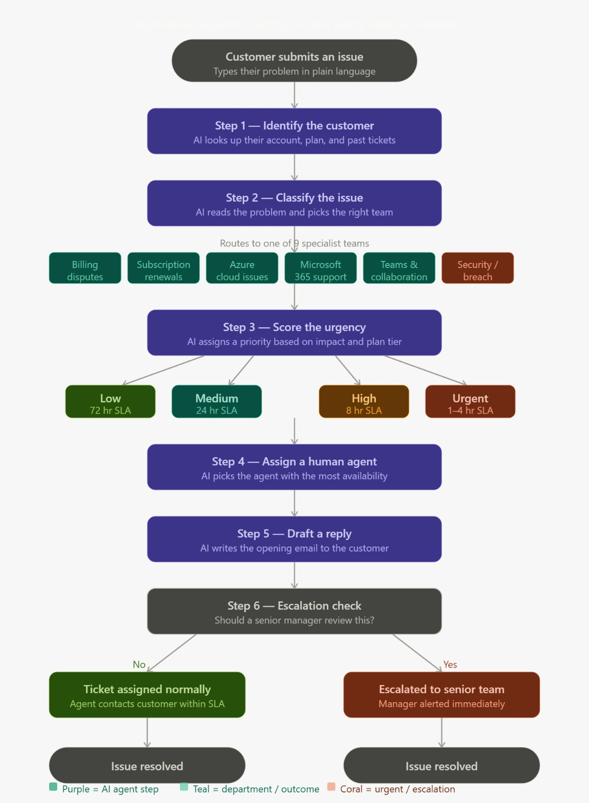

# Multi-Agent Ticket Routing System

An end-to-end AI-powered customer support system built with **CrewAI**, **Claude**, and **Gradio**. Six specialist AI agents work in sequence to classify, prioritise, assign, and respond to support tickets — backed by a real SQLite database with 60 customers, 20 agents, and 14 departments modelled after Microsoft's support hierarchy.

---

## What it does

A customer submits a support issue in plain language. The AI crew takes over completely:

| Agent | Role | What it does |
|---|---|---|
| Intake Specialist | Identifies the customer | Looks up account, plan, tier, and ticket history |
| Issue Classifier | Routes the ticket | Picks the correct sub-department with a confidence score |
| Priority Analyst | Scores urgency | Assigns low / medium / high / urgent based on impact and tier |
| Dispatcher | Assigns a human agent | Finds the agent with the most remaining capacity |
| Communications Agent | Drafts the reply | Writes a personalised opening email to the customer |
| Escalation Reviewer | Makes the final call | Flags tickets for senior review when needed |

---

## Demo

Five real-world scenarios are pre-loaded in the UI:
- Azure tenant compromise (security breach)
- M365 subscription charged after expiry (billing)
- AKS pods failing in production (Azure cloud)
- MFA lockout after new phone (authentication)
- 500-seat volume license expiring in 4 days (licensing)

---

## System flowchart



---

## Architecture

```
customer submits issue
        │
        ▼
┌───────────────────────────────────┐
│         CrewAI Pipeline           │
│                                   │
│  1. Intake Specialist             │
│  2. Issue Classifier              │  ◄── Claude Haiku (claude-haiku-4-5)
│  3. Priority Analyst              │
│  4. Dispatcher                    │
│  5. Communications Agent          │
│  6. Escalation Reviewer           │
└───────────────┬───────────────────┘
                │
        ┌───────▼────────┐
        │   SQLite DB    │
        │                │
        │  customers     │
        │  departments   │
        │  agents        │
        │  tickets       │
        └────────────────┘
                │
        ┌───────▼────────┐
        │   Gradio UI    │
        │                │
        │  Submit ticket │
        │  Ticket queue  │
        │  Agent roster  │
        │  Analytics     │
        └────────────────┘
```

### Department hierarchy

```
Microsoft Support HQ  (L0)
├── Subscriptions  (L1)
│   ├── Billing
│   └── Renewals
├── Technical Support  (L1)
│   ├── Azure Support
│   ├── Microsoft 365 Support
│   └── Teams & Collaboration
├── Licensing  (L1)
│   ├── Volume Licensing
│   └── OEM & Retail
└── Security  (L1)
    ├── MFA & Authentication
    └── Breach Response
```

---

## Tech stack

| Layer | Technology |
|---|---|
| AI agents | [CrewAI](https://crewai.com) |
| LLM | Claude Haiku (`claude-haiku-4-5`) via Anthropic API |
| UI | [Gradio](https://gradio.app) |
| Database | SQLite (via Python `sqlite3`) |
| Seed data | [Faker](https://faker.readthedocs.io) |

---

## Project structure

```
├── seed_db.py              # Creates and seeds the database (run once)
├── db.py                   # Database access layer — all SQL lives here
├── crew.py                 # CrewAI agents, tasks, tools, and pipeline
├── app.py                  # Gradio UI — 4 tabs with live streaming updates
├── support.db              # SQLite database (generated by seed_db.py)
├── imgs/
│   ├── flowchart.jpeg      # End-to-end system flowchart
│   └── support_db_erd.html # Interactive database schema diagram
└── README.md
```

---

## Getting started

### 1. Clone the repo

```bash
git clone https://github.com/hardikdeshmukh999/Multi-Agent-Ticket-Routing-System.git
cd Multi-Agent-Ticket-Routing-System
```

### 2. Create and activate a virtual environment

```bash
python -m venv venv

# Mac / Linux
source venv/bin/activate

# Windows
venv\Scripts\activate
```

### 3. Install dependencies

```bash
pip install anthropic gradio faker crewai
```

### 4. Set your Anthropic API key

```bash
# Mac / Linux
export ANTHROPIC_API_KEY=sk-ant-...

# Windows PowerShell
$env:ANTHROPIC_API_KEY="sk-ant-..."
```

Or create a `.env` file in the project root:

```
ANTHROPIC_API_KEY=sk-ant-...
```

Then add to the top of `crew.py`:

```python
from dotenv import load_dotenv
load_dotenv()
```

Get your API key at [console.anthropic.com](https://console.anthropic.com).

### 5. Seed the database

```bash
python seed_db.py
```

This creates `support.db` with:
- 14 departments across 3 levels
- 20 support agents with realistic workloads
- 60 customers across consumer, SMB, and enterprise tiers
- 55 pre-seeded tickets covering all real-world issue types

### 6. Launch

```bash
python app.py
```

Open `http://127.0.0.1:7860` in your browser.

---

## Database schema

> Open `imgs/support_db_erd.html` in any browser for the full interactive entity-relationship diagram.

| Table | Rows | Purpose |
|---|---|---|
| `departments` | 14 | Full L0→L1→L2 hierarchy with SLA hours and escalation paths |
| `customers` | 60 | Name, email, subscription plan, region, account tier |
| `agents` | 20 | Name, department, level, live workload tracking |
| `tickets` | 55+ | Issue text, priority, status, assignment, timestamps |

### Relationships at a glance

```
customers   ──< tickets    (one customer raises many tickets)
departments ──< tickets    (one department handles many tickets)
departments ──< agents     (one department employs many agents)
agents      ──< tickets    (one agent is assigned many tickets)
departments ──< departments (parent / child hierarchy)
```

### Priority levels and SLA

| Priority | SLA | Typical issue |
|---|---|---|
| Low | 72 hours | Cosmetic bugs, general questions |
| Medium | 24 hours | Feature issues, sync problems |
| High | 8 hours | Billing errors, degraded service |
| Urgent | 1–4 hours | Security breaches, MFA lockouts, outages |

---

## UI tabs

**Submit Ticket** — Enter a customer email and issue description. Watch all 6 agents work in real time with live status updates every 2 seconds. View the full routing result, assigned agent, drafted reply, and escalation decision.

**Ticket Queue** — Browse all tickets in the database with customer name, plan, department, priority, status, assigned agent, and creation date.

**Agent Roster** — View all 20 agents with their department, level, and a live workload bar showing current vs maximum ticket capacity.

**Analytics** — Operations dashboard showing ticket volume by status, distribution by department, priority breakdown, and the top 10 most loaded agents.

---

## Key design decisions

**Why CrewAI?** Each agent has a single responsibility — the Intake Specialist never makes routing decisions, and the Escalation Reviewer never touches the database. This mirrors how real support operations work and makes the system easy to extend.

**Why SQLite?** Zero infrastructure. The entire database is one file you can open, inspect, and version-control. Swap in Postgres with one line change in `db.py`.

**Why Haiku?** Fast and cost-effective for structured routing tasks. The full pipeline runs in 60–90 seconds for all 6 agents. Upgrade to Sonnet in `crew.py` for more nuanced reasoning on complex tickets.

**Why streaming?** The crew takes ~90 seconds to run. The Gradio generator (`yield`) pushes live updates every 2 seconds so you see each agent's output as it completes rather than staring at a frozen screen.

---

## Built by

Hardik Deshmukh